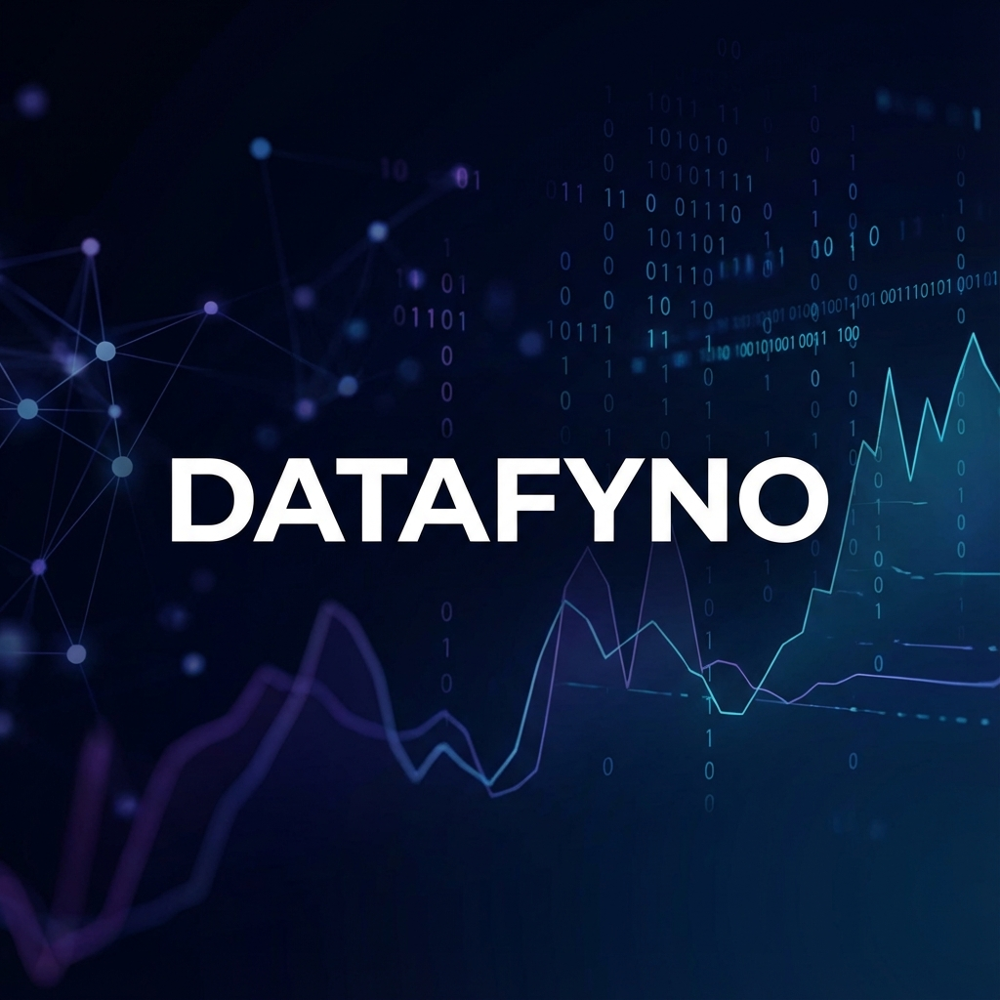
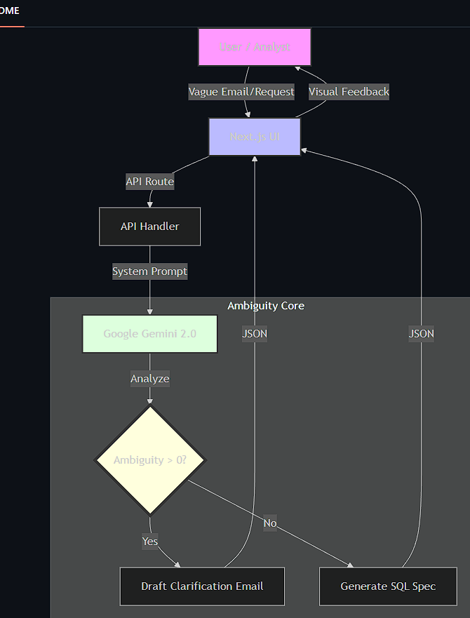

# Datafyno - AI Requirements Refiner

> **Built for SnowFest 2025**
> By **Team Enlighteners**



## 💡 Inspiration
Every data analyst knows the pain. A notification pops up on Slack: _"Hey, can you pull the sales numbers for the last campaign?"_

It looks simple, but it’s a nightmare. Which campaign? Which region? Gross or net sales? By "last," do they mean Q3 or the Halloween promo?

We realized that **50% of a data analyst's job isn't writing SQL—it's acting as a translator.** We waste hours in the "Clarification Loop," emailing back and forth just to understand what the stakeholder actually wants. We built **Datafyno** to end that loop forever.

## 🚀 What it does
Datafyno is the first **AI Ambiguity Detector** for data teams. It acts as a firewall between vague human requests and precise database queries. 

Unlike standard chatbots that hallucinate an answer based on a guess, Datafyno is programmed to **stop** when it detects missing context.

1.  **It Analyzes:** It scans the request for missing dimensions (Time, Metric, Filter).
2.  **It Detects Ambiguity:** It calculates an Ambiguity Score (A) based on the sum of weighted missing variables:
    
    > **A = Σ (Weight × Missing_Variable)**
    
    *Where "Weight" is the importance of the missing metric (e.g., a missing 'Date Range' has a higher weight than a missing 'Region').*
3.  **It Pushes Back:** If $$A > 0$$, it automatically drafts a polite, professional clarification email.
4.  **It Solves:** Once clarified, it generates the perfect, clean SQL specification.

## ⚙️ Architecture



## 👥 Team Enlighteners

<table>
  <tr>
    <td align="center">
      
      <br />
      <sub><b>Muhammad Awais</b></sub>
      <br />
      <small>Blockchain Analytics Engineer</small>
    </td>
    <td align="center">
      
      <br />
      <sub><b>Abdul Raffay</b></sub>
      <br />
      <small>ML Scientist</small>
    </td>
  </tr>
</table>

## 🛠️ Tech Stack
- **Frontend Framework**: [Next.js 15](https://nextjs.org/) (App Router)
- **Styling**: [Tailwind CSS](https://tailwindcss.com/)
- **Animations**: [Framer Motion](https://www.framer.com/motion/) (Complex choreography and physics-based transitions)
- **AI Intelligence**: [Google Gemini 2.0 Flash](https://deepmind.google/technologies/gemini/) (via Vertex AI)
- **Language**: TypeScript

## 🧠 Challenges we ran into
The biggest challenge was tuning the AI to **not** be helpful. Most LLMs try to be "nice" and guess what you mean. We had to fight that training. We had to embrace "Prompt Engineering for Skepticism"—teaching the model that *guessing is a failure* and that *asking a clarifying question is a success*.

Balancing the UI was also tricky. We wanted it to look futuristic but still be functional for a serious data workflow. We spent a lot of time ensuring the "Ambiguity Cards" and "Email Drafts" felt distinct and actionable.

## 🔮 What's next for Datafyno
We successfully implemented the core "Ambiguity Detection" and "Auto-Email" loops. Next, we plan to:
1.  Directly integrate with **Slack bots** to intercept vague requests *before* they even reach the analyst.
2.  Connect to real database schemas (Snowflake/BigQuery) so the "Data Spec" creates valid, runnable SQL instantly.

## 🏃‍♂️ How to Run

1. Clone the repo
   ```bash
   git clone https://github.com/Enlighteners/datafyno.git
   ```
2. Install dependencies:
   ```bash
   npm install
   ```
3. Run the development server:
   ```bash
   npm run dev
   ```
4. Open [http://localhost:3000](http://localhost:3000)

---
*Built with ❤️ by Team Enlighteners*
